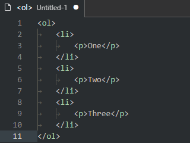
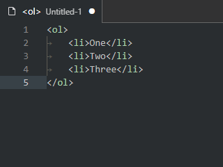
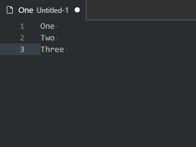
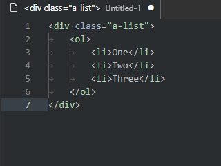
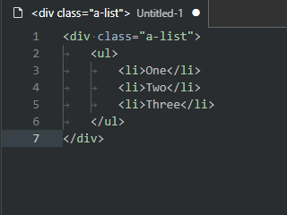
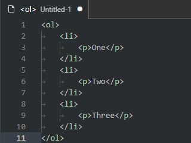
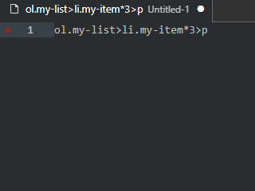

[hr01]: https://bognaum.github.io/vscode-emmet-commands-and-keybindings/IMG/screenshot-01-01.png
[hr02]: https://bognaum.github.io/vscode-emmet-commands-and-keybindings/IMG/screenshot-02.png
[hr03]: https://bognaum.github.io/vscode-emmet-commands-and-keybindings/IMG/screenshot-03.png

# Emmet commands and keybindings
According to [Emmet documentation](https://docs.emmet.io/) Emmet has three base features:

1. abbreviation expanding
2. Emmet actions - the commands for advanced editing of HTML code
3. Emmet snippets 

We all know about the first feature, but I suggest you pay attention to Emmet actions.

## Emmet actions
Emmet actions may be very useful. For example:

- remove element 
	- [Emmet docs demo](https://docs.emmet.io/actions/remove-tag/) 
	- [demo below](#delete-tag-demo)
- select element content or whole element or parent element (balance in/out)
	- [Emmet docs demo](https://docs.emmet.io/actions/match-pair/) 
	- [demo below](#balance-out-demo)
- iterate by edit points after the abbreviation is expanded 
	- [Emmet docs demo](https://docs.emmet.io/actions/go-to-edit-point/) 
	- [demo below](#items-and-edit-points-demo)
- select a tag name and attributes to edit 
	- [Emmet docs demo](https://docs.emmet.io/actions/select-item/) 
	- [demo below](#items-and-edit-points-demo)
- wrap some html-code with abbreviation 
	- [Emmet docs demo](https://docs.emmet.io/actions/wrap-with-abbreviation/#wrap-with-abbreviation) 
	- [demo below](#wrap-everything-together)
- wrap with abbreviation the every line individually 
	- [Emmet docs demo](https://docs.emmet.io/actions/wrap-with-abbreviation/#wrapping-individual-lines)
	- [demo below](#wrap-the-every-line-individually)
- rename element
	- [demo below](#rename-tag-demo)
- and some other


## In this extension:
- Added a keybinding system for the most used commands. You may see the keybindings if you open the above submenu.
- Creates a submenu of the editor title menu with all existing in VS Code Emmet commands. 
- The titles of existing in VS Code command have changed to more understandable.
- If you will add your own keybindings - you will see your keybindings in the above submenu.

## Keybindings
- ```Alt+E, E``` - Expand abbreviation.
- ```Ctrl+Shift+A``` Balance out.

- ```Alt+<``` / ```Alt+>``` - Previous / next edit point.
- ```Ctrl+Alt+<``` / ```Ctrl+Alt+>``` - Previous / next item.

- ```Alt+E, D``` - Delete tag.
- ```Alt+E, R``` - Rename tag.
- ```Alt+E, W``` - Wrap with abbreviation.
- ```Alt+E, M``` - Merge lines.
- ```Alt+E, =``` - Evaluate math expression.
- ```Alt+E, Alt+/``` - Toggle comment (to HTML only).

## Notes:
- Not all commands existing in the [Emmet documentation](https://docs.emmet.io/) have implemented in VS Code.
- Assigned keybindings does not correspond to the keybindings of [Emmet documentation](https://docs.emmet.io/).

## Balance out demo
```Ctrl+Shift+A``` - Select the content of an element, then the element with tags, then the content of parent element, ect.



## Wrap with abbreviation demo

### Wrap everything together
```Alt+E, W```



### Wrap the every line individually
```Alt+E, W```



## Rename tag demo

```Alt+E, R```



## Delete tag demo

```Alt+E, D```




## Items and edit points demo

- ```Alt+<``` / ```Alt+>``` - Previous / next edit point.
- ```Ctrl+Alt+<``` / ```Ctrl+Alt+>``` - Previous / next item.



## Menu of all Emmet commands.

[![hr01]][hr01]

<!-- [![hr02]][hr02] -->

<!-- [![hr03]][hr03] -->
